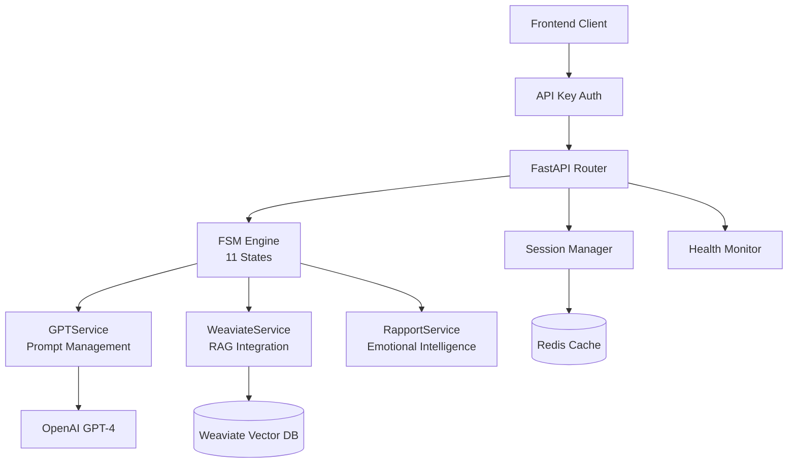

# WuffChat Backend API

**Production V2**: FastAPI with 11-state FSM | **V3 Development**: BDI agent architecture

FastAPI backend service powering WuffChat's AI-driven dog behavior consultations through GPT-4 integration and vector-based knowledge retrieval.

## Technical Architecture



### Core Services
- **FSMService**: 11-state conversation flow with natural transitions
- **GPTService**: Context-aware prompt management and OpenAI integration
- **WeaviateService**: Vector search for breed-specific behavioral insights
- **RapportService**: Emotional intelligence and presence markers
- **ValidationService**: Input sanitization and security validation

### FSM States & Flow
```
GREETING → INFO_DOG → INFO_BREED → INFO_AGE → INFO_CASTRATED → 
INFO_SINCE_WHEN → SYMPTOM_DESCRIPTION → ANALYSIS → 
SOLUTION → EMAIL_COLLECTION → AGENTIC_COLLECTION
```

## Quick Start

```bash
# Setup environment
python -m venv venv
source venv/bin/activate
pip install -r requirements.txt

# Configure environment
cp .env.development.template .env.development
# Edit .env.development with your API keys

# Run development server
python src/main.py
```

## API Reference

### Core Endpoints
```http
POST /flow_intro
Content-Type: application/json
X-API-Key: your-api-key

{
  "message": "Mein Hund bellt ständig"
}
```

```http
POST /flow_step
Content-Type: application/json
X-API-Key: your-api-key

{
  "session_token": "uuid-token",
  "message": "Er heißt Max und ist 3 Jahre alt"
}
```

### Response Format
```json
{
  "response": "AI response text with presence markers",
  "session_token": "session-uuid",
  "current_state": "INFO_DOG",
  "session_expires_at": "2024-01-01T12:00:00Z"
}
```

## Security Implementation

### Multi-Layer Protection
- **API Key Authentication**: X-API-Key header validation
- **Session Management**: UUID tokens with 30-minute expiration
- **Rate Limiting**: Configurable per endpoint (10-30 req/min)
- **Input Validation**: Pydantic models with sanitization
- **CORS Policy**: Strict origin control
- **Security Headers**: HSTS, CSP, X-Frame-Options

### Environment Variables
```bash
API_KEY=your-secure-api-key
OPENAI_API_KEY=your-openai-key
WEAVIATE_URL=your-weaviate-cluster
WEAVIATE_API_KEY=your-weaviate-key
REDIS_URL=your-redis-url  # Optional
```

## Testing & Development

```bash
# Run tests
pytest tests/ -v

# Run with hot reload
uvicorn src.main:app --reload --port 8000

# Check API docs
curl http://localhost:8000/docs
```

### Development Features
- **Health Monitoring**: `/health` endpoint with service status
- **Interactive Docs**: Auto-generated OpenAPI documentation
- **Error Tracking**: Comprehensive logging and error handling
- **Graceful Degradation**: Works without Redis for local development

## Deployment

### Production Stack
- **Platform**: Scalingo (Heroku-compatible)
- **Python**: 3.11+ with gunicorn
- **Monitoring**: Health checks and error tracking
- **Scaling**: Horizontal scaling with Redis session store

---

**Back to WuffChat meta-repository** - see [wuffchat](https://github.com/kemperfekt/wuffchat) for complete overview